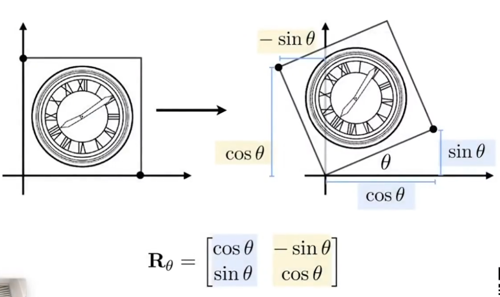
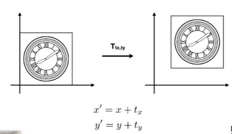
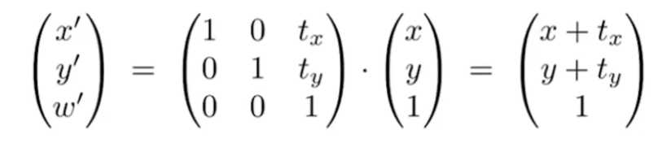

# 作业 0：环境配置与齐次坐标变换

## 环境配置

虚拟机这玩意真是众生平等，不管你电脑配置好不好，都能搞出一堆疑难杂症恶心死你。在配置失败十几次、敲了不下一百遍 `Ilovegraphics` 之后我终于放弃了作业框架提供的 VirtualBox 环境，改用 WSL Ubuntu。

其实作业环境非常简单，只要装上基本的 C++ 编程环境、cmake、eigen 库和 opencv 库，作业框架就能正常编译运行了。

```bash
sudo apt install build-essential cmake libeigen3-dev libopencv-dev
```

最新的 WSL 支持直接运行 Linux 上的 GUI 程序，非常离谱。因此后续的作业中需要用 OpenCV 显示窗口也不需要任何额外修改和配置。

## 齐次坐标变换

这是单独的线性变换：



图中的就是旋转矩阵，蓝色部分代替了原本的 x 基向量，黄色代替了原本的 y 基向量。

这是单独的平移：



把向量新增一个维度，将两个操作合并，先变换后平移，就是齐次坐标变换：



### 新增维度 w

规定当齐次坐标表示向量时 w=0，表示点时 w=1，这样就能实现“点 - 点 = 向量”。

w 决定了**平移的倍率**。

因为向量只表示方向，与位置无关，具有平移不变性，所以对向量（w=0）应用变换矩阵，只有线性变换生效，平移不会生效。而对点（w=1）应用变换矩阵，线性变换和平移都会生效。如果 w 的值为 2，线性变换的效果不变，平移量会加倍。

整个向量除以 w 的操作叫**归一化**。

## 题解

作业要求：给定点 P（2，1），求出逆时针旋转 45 度，然后平移（1，2）的坐标。

直接套公式写出矩阵，一个左乘就算出来了。

``` cpp
Eigen::Vector3f p(2.0, 1.0, 1.0);
Eigen::Matrix3f m_transform;
m_transform << sqrt(0.5), -sqrt(0.5), 1, sqrt(0.5), sqrt(0.5), 2, 0, 0, 1;
std::cout << (m_transform * p) << std::endl;
```

变换结果是 `(1.70711, 4.12132, 1)`
