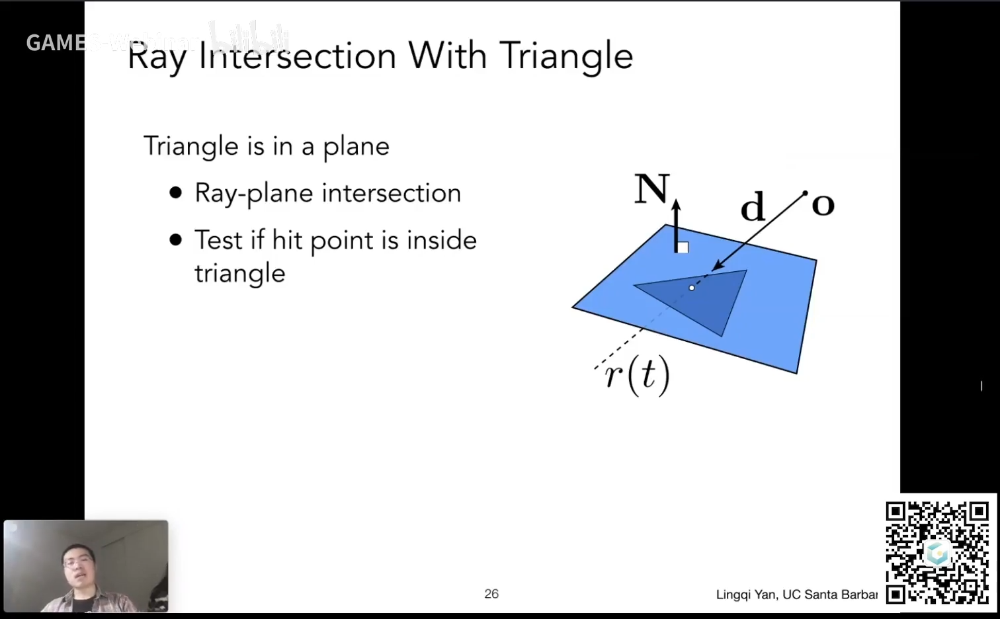
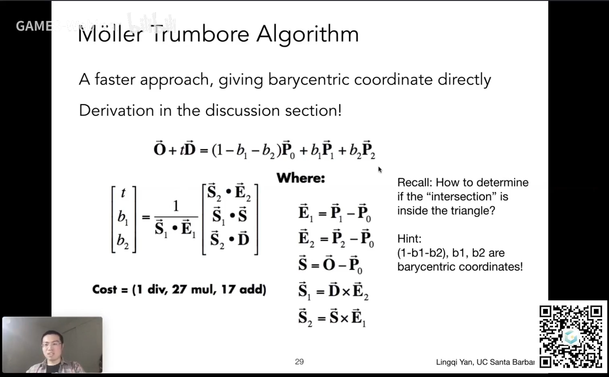

# 作业 5：光线与三角形相交

## 背景知识

[精准空降](https://www.bilibili.com/video/BV1X7411F744?t=2313&p=13)

### 基本思路



基本思路：

1. 求光线和平面的交点（解方程）

2. 求该交点是否在三角形内部（叉积，和光栅化判断像素是否在三角形内部差不多）

### Moller-Trumbore 算法



这个算法解出光线与平面相交的**时间 t 与重心坐标 (1 - b1 - b2), b1, b2**，如果 t > 0，三个重心坐标 > 0，光线就与三角形相交。

## 作业

### 生成光线

```C++
x = ((float)i / scene.width - 0.5f) * 2 * scale * imageAspectRatio;
y = -((float)j / scene.height - 0.5f) * 2 * scale;
Vector3f dir = Vector3f(x, y, -1); // Don't forget to normalize this direction!
dir = normalize(dir);
```

