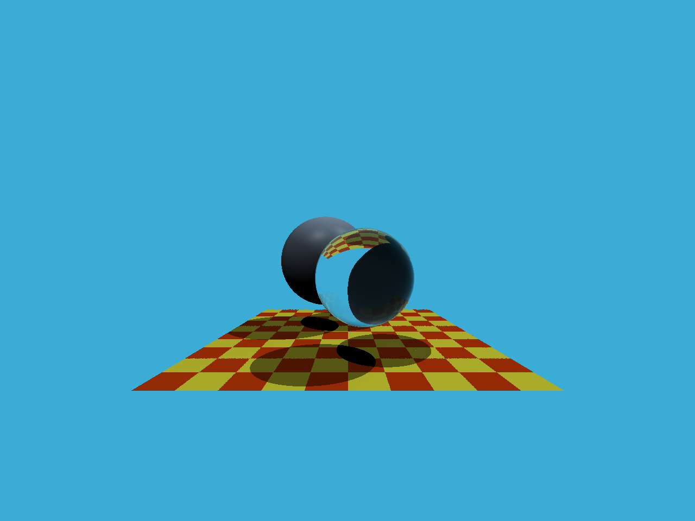

# 作业 5：光线与三角形相交

## 背景知识

### 基本思路

[精准空降](https://www.bilibili.com/video/BV1X7411F744?t=2313&p=13)


1. 求光线和平面的交点（解方程）

2. 求该交点是否在三角形内部（叉积，和光栅化判断像素是否在三角形内部差不多）

### Moller-Trumbore 算法


这个算法解出光线与平面相交的**时间 t 与重心坐标 (1 - b1 - b2), b1, b2**，如果 t > 0，三个重心坐标 > 0，光线就与三角形相交。

## 作业

### 生成光线

在纸上画一下，转换一下比例就好了，前几次作业也有类似的比例转换。

```C++
x = ((float)i / scene.width - 0.5f) * 2 * scale * imageAspectRatio;
y = -((float)j / scene.height - 0.5f) * 2 * scale;
Vector3f dir = Vector3f(x, y, -1); // Don't forget to normalize this direction!
dir = normalize(dir);
```

效果如图，作业框架已经写好了球体的相交逻辑，所以球体已经显示出来了。接下来实现三角形的相交逻辑，就能显示出用三角形定义的地面了。


### 三角形相交

又到了我最喜欢的套公式时间（

这次套的公式甚至不需要矩阵乘法，直接一通点积叉积加减乘除就能算出来。唯一迷惑的地方是 tnear u v 这三个变量都是些啥玩意，其实就是方程的解 t b1 b2，似乎这三个值除了判断是否相交还有别的用途。

```C++
// 定义 E 和 S
Vector3f e1 = v1 - v0;
Vector3f e2 = v2 - v0;
Vector3f s = orig - v0;
Vector3f s1 = crossProduct(dir, e2);
Vector3f s2 = crossProduct(s, e1);
// t, b1, b2 的解
tnear = dotProduct(s2, e2) / dotProduct(s1, e1);
u = dotProduct(s1, s) / dotProduct(s1, e1);
v = dotProduct(s2, dir) / dotProduct(s1, e1);
// 判断相交
if (tnear > 0 && u > 0 && v > 0 && (1 - u - v) > 0)
{
    return true;
}
return false;
```

现在地板已经显示出来，并参与光的反射了。


