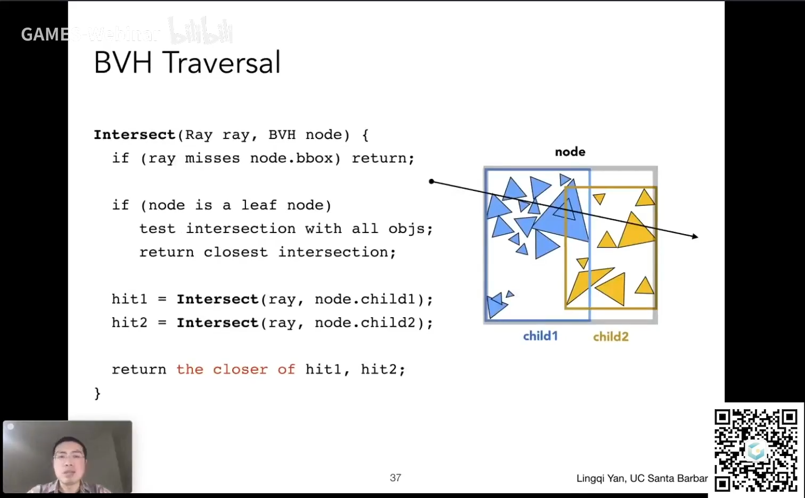

# 作业 6：加速结构

## 背景知识

光线与包围盒相交好算，与具体物体相交难算，所以可以通过计算光线是否与物体所在的包围盒相交，排除一些明显不相交的物体，节省计算开销。

划分空间形成包围盒的方法主要有八叉树、KD-Tree、BSP Tree，但是管它嘞，作业又不考这些（

现在主流的做法并不是直接划分空间，而是一种称为 **BVH** 的方法，把一部分挨得近的物体包在一个盒子里，另一部分物体包在另一个盒子里。

### 构建 BVH

[BVH（精准空降）](https://www.bilibili.com/video/BV1X7411F744?t=2278.0&p=14)

基本思路：

1. 找到包围盒
2. 把包围盒内部物体分成两堆
3. **重新计算各堆的包围盒**
4. 递归执行上面三步，在差不多的时候停下来

第二步如何切分非常重要：

1. 总是切最长的轴
2. 在该轴向上物体坐标的**中位数**的位置切分

比如包围盒在 z 轴向上的边长最长，就切 z 轴。盒子里所有物体的 z 坐标分别是 1 2 7 8 9，就在中位数 7 切一刀。

> 关于找中位数，闫老师提到了[快速选择](https://zh.wikipedia.org/wiki/快速选择)算法，这个算法可以找出第 k 小的数。快选和快排几乎一样，不过快选更加简单，它只需要让第 k 小的数回到正确的位置，其它的数有没有序都无所谓，只要比它小的都在左边，比它大的都在右边就行。所以每次递归只要处理位置 k 所在的半边，最后把要处理的区间收缩到位置 k 就行了。

### 光线和 BVH 求交

## 作业
