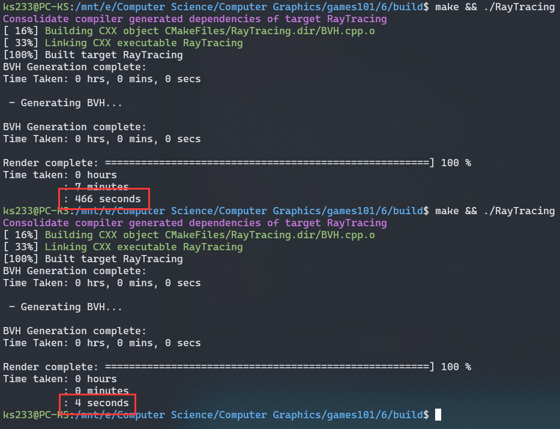

# 作业 6：加速结构

## 背景知识

光线与包围盒（AABB）相交好算，与具体物体相交难算，所以可以通过计算光线是否与物体所在的包围盒相交，排除一些明显不相交的物体，节省计算开销。

通过“划分空间”形成包围盒的方法主要有八叉树、KD-Tree、BSP Tree，但这些做法产生的包围盒并不紧凑，而且可能会使物体的一部分在一个包围盒，另一部分在另一个包围盒，非常麻烦。

现在主流的做法并不是直接划分空间，而是一种称为 **BVH** 的方法，根据物体划分空间，把一部分挨得近的物体包在一个盒子里，另一部分物体包在另一个盒子里。

### 构建 BVH（作业不要求）

[BVH（bilibili 精准空降）](https://www.bilibili.com/video/BV1X7411F744?t=2278.0&p=14)

基本思路：

1. 找到包围盒
2. 把包围盒内部物体分成两堆
3. **重新计算各堆的包围盒**
4. 递归执行上面三步，在差不多的时候停下来

第二步如何切分非常重要：

1. 总是切最长的轴
2. 在该轴向上物体坐标的**中位数**的位置切分

比如包围盒在 z 轴向上的边长最长，就切 z 轴。盒子里所有物体的 z 坐标分别是 1 2 7 8 9，就在中位数 7 切一刀。

> 关于找中位数，闫老师提到了[快速选择](https://zh.wikipedia.org/wiki/快速选择)算法，这个算法可以找出第 k 小的数。快选和快排几乎一样，不过快选更加简单，它只需要让第 k 小的数回到正确的位置，其它的数有没有序都无所谓，只要比它小的都在左边，比它大的都在右边就行。所以每次递归只要处理位置 k 所在的半边，最后把要处理的区间收缩到位置 k 就行了。

## 作业

本次作业内容：

- 修改 `Render.cpp` 和 `Triangle.hpp` 中的部分代码，使其适应新的作业框架
- 判断射线与 AABB 是否相交
- 递归地找到与光线相交的 BVH 叶子节点，然后与节点内的物体求交

### Render.cpp

作业 5 的 `castRay` 是这么写的：

```C++
castRay(eye_pos, dir, scene, 0);
```

作业 6 中，`castRay` 变成了 scene 的方法，光线被包装成了一个 `Ray` 类，所以要改成：

```C++
Vector3f dir = Vector3f(x, y, -1);
dir = normalize(dir);
framebuffer[m++] = scene.castRay(Ray(eye_pos, dir), 0);
```

### Triangle.hpp

需要修改的是 `getIntersection`，首先观察结构体 `Intersection` 的定义：

```C++
struct Intersection
{
    Intersection(){
        happened=false;
        coords=Vector3f();
        normal=Vector3f();
        distance= std::numeric_limits<double>::max();
        obj =nullptr;
        m=nullptr;
    }
    bool happened;
    Vector3f coords;
    Vector3f normal;
    double distance;
    Object* obj;
    Material* m;
};
```

`Intersection` 的 happened 默认为 `false`，还携带了交点坐标、法向量、距离、物体、材质信息。

回到 `Triangle.hpp`，在 `getIntersection` 中，前面已经处理了不相交的情况，如果不相交会直接返回一个默认的 happened=false 的 Intersection。

不相交的在函数前半段就已经返回了，所以函数后半段都是相交了的逻辑。在函数末尾，我们要做的是将相交信息装载到结构体并返回：

```c++
inter.happened = true;
inter.coords = ray(t_tmp); // Ray类的括号运算符重载，表示ray在t_tmp时间的位置
inter.normal = normalize(normal);
inter.m = this->m;
inter.obj = this;
inter.distance = t_tmp;
return inter;
```

### AABB 与射线相交

接下来修改的是 `Bounds3.hpp` 中的 `IntersectP` 函数，做之前先可以复习一下课程视频。

[AABB 与射线相交（bilibili 精准空降）](https://www.bilibili.com/video/BV1X7411F744?t=3669.0&p=13)

其实这函数只要有一个光线传进来就够了，但它还传了 `invDir` 和 `dirIsNeg` 两个参数，算是给了一些提示，如果你没用上这俩，说明写得肯定有问题。

`invDir` 是方便计算时间 t 用的，本来要用距离除以方向向量，现在有倒数就能直接乘了，作业框架里说乘法比除法更快。

`dirIsNeg` 用来判断平面对于光线的先后顺序。比如包围盒有 x=2 和 x=5 两个平面，射线的 `direction.x` 为正，那它会先到达 2 再到达 5，如果为负就是先到达 5 后到达 2。

我的代码：

```c++
float x1 = (dirIsNeg[0] ? pMax.x : pMin.x) - ray.origin.x;
float x2 = (dirIsNeg[0] ? pMin.x : pMax.x) - ray.origin.x;
float y1 = (dirIsNeg[1] ? pMax.y : pMin.y) - ray.origin.y;
float y2 = (dirIsNeg[1] ? pMin.y : pMax.y) - ray.origin.y;
float z1 = (dirIsNeg[2] ? pMax.z : pMin.z) - ray.origin.z;
float z2 = (dirIsNeg[2] ? pMin.z : pMax.z) - ray.origin.z;

float t_enter = std::max({x1 * invDir.x, y1 * invDir.y, z1 * invDir.z});
float t_exit = std::min({x2 * invDir.x, y2 * invDir.y, z2 * invDir.z});

return t_enter < t_exit && t_exit >= 0;
```

x1 表示射线在 x 方向上与前面的平面的距离，x2 表示与后面平面的距离。三目运算符的作用是在方向为负时交换两个平面的先后顺序。

### 包围盒递归求交

有伪代码，直接开抄！！！！


```C++
// 如果没有相交，直接返回默认值
auto is_neg = std::array<int, 3>{int(ray.direction.x < 0), int(ray.direction.y < 0), int(ray.direction.z < 0)};
if (!node->bounds.IntersectP(ray, ray.direction_inv, is_neg))
{
    return Intersection();
}
// 如果是叶子节点
if (node->left == nullptr)
{
    return node->object->getIntersection(ray);
}
// 继续递归
Intersection hit1 = getIntersection(node->left, ray);
Intersection hit2 = getIntersection(node->right, ray);
// 都相交返回最短
if (hit1.happened && hit2.happened)
{
    return hit1.distance < hit2.distance ? hit1 : hit2;
}
else if (hit1.happened && !hit2.happened)
{
    return hit1;
}
else
{
    return hit2;
}
```

关于处理叶子节点部分，图上的伪代码说要与“all objs”求交，然后返回最近的，但作业框架构建的 BVH 树中，叶子节点只会有一个 object，和这个唯一的 object 求交就行。

到这里程序就能正常完成斯坦福兔子的渲染。


最后对比一下有无加速的差别。如果把上面函数中的第一个 if 注释掉，无差别地递归所有子节点，在我电脑上的用时是 466 秒，而通过排除不相交的 AABB 对递归过程进行剪枝，只要 4 秒就能完成渲染，差距非常明显。


