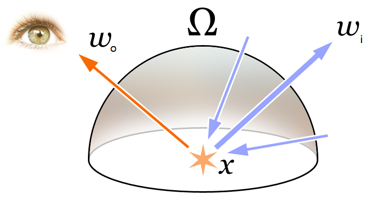

# 作业 7：路径追踪

## 背景知识

### 渲染方程

Whitted-Style 的不足：

1. 只支持完全镜面反射和折射，不支持“有点镜面但不完全镜面”的材质。
2. 光线遇到漫反射材质直接停止反弹，不符合能量守恒定律，没有全局光照 color bleeding 的效果。

为了渲染出符合物理规律的真实画面，需要用到渲染方程：


渲染方程回答了这样的问题：**某物体上的一点 p 在 w_o 方向上发出多少光？**



（games101 点坐标记为 p，wiki 图上记为 x，不要在意这些细节）

- 出射光 L_o：出射光强度，可以理解为从 w_o 方向观测到点 p 的光强度。
  - p：光线打中的点的坐标。
  - w_o：出射方向向量。（o=outgoing）


- 自发光 L_e：物体在点 p、w_o 方向上的自发光强度。（e=emission）
- 反射方程
  - w_i：入射方向向量，反射方程的积分变量。（i=incident）
  - Ω+：因为四面八方的入射光都对反射光有一定的贡献，所以要考虑所有入射光，对入射方向 w_i 积分。Ω+ 表示积分范围是个半球。
  - L_i：入射光的强度，因为光线会不断反弹，所以 L_i 由其它物体的 L_o 组成，求 L_i 是一个递归的过程。
  - f_r：BRDF，表示在点 p 从 w_i 方向入射的光有多少比例反射到了 w_o 方向。不同的材质有不同的反射分布规律，比如镜面材质的反射能量集中在与入射方向对称的方向，漫反射材质的反射能量均匀地分散在半球的各个方向。
  - (n·w_i)：法向量和入射光向量夹角的余弦值。（Lambert 余弦定理：同样强度的光，斜着照比正着照更暗。）

### 光栅化与光追

其实光栅化就是只计算光线反弹 0 次（自发光）和 1 次（物体受到光照）的结果，而光追会使光线在物体之间反弹，就有了镜面反射、全局光照等效果。

### 蒙特卡洛积分

渲染方程的整体结构长这样：

```
出射光强度 = 自发光（由材质决定）+ 反射方程（一坨有点难算还带递归的积分）
```

为了在有限的时间内把那坨积分解出来，Path Tracing 采用了蒙特卡洛积分法。


要求一个 f(x) 的定积分，蒙特卡洛积分是这么做的：随机取一个 x 求函数值，然后乘以积分区间的长度，得到一个长方形的面积。多取样几次，把算出来的长方形的面积求平均，就能蒙出函数积分的近似值。取样越多，蒙得越准。


这里的 p(x) 是概率分布函数，它隐含了积分区间的信息。

举个例子，求某 f(x) 在 0~5 的积分，那么 p(x) 就应该长这样：


这意味着 x 将在 0~5 均匀地取样，而取到 0~5 范围以外的值的概率为 0。

套上面的公式，不管取样在哪里，除以 p(x) 其实都是除以 0.2，也就是乘以区间长度 5。

所以 p(x) 隐含了区间的取样范围，并且因为均匀分布，p(x) 的倒数 = 取样范围长度。

上面只是一个简单的例子。在渲染方程中，积分变量并不是一维实数，而是一个表示入射光方向的三维向量，积分范围当然也不是一维的实数区间，而是一个半球范围。但思路是一样的：随便取一个方向，算出反射光，除以取到该方向的概率。

### Path Tracing

路径追踪的初步伪代码：

```pseudocode
shade(p, wo)
    Randomly choose ONE directions w_i~pdf
    Trace a ray r(p, wi)
    If ray r hit the light
        Return (1 / N) * L_i * f_r * cosine / pdf(wi)
    Else If ray r hit an object at q
        Return (1 / N) * shade(q, -wi) * f_r * cosine / pdf(wi)
```

1. 蒙特卡洛积分：随机选取入射方向计算反射方程，除以 pdf。
2. 只随机取**一个**入射方向，因为如果取的方向数量更多，多递归几层就指数爆炸了。（如果取多个入射方向，就叫分布式光线追踪）

这个代码没有递归出口，如果光线一直在物体之间弹射就会陷入死循环，引入“俄罗斯轮盘赌”：

```pseudocode
shade(p, wo)
    Manually specify a probability P_RR
    Randomly select ksi in a uniform dist. in [0, 1]
    If (ksi > P_RR) return 0.0;
    
    Randomly choose ONE direction wi~pdf(w)
    Trace a ray r(p, wi)
    If ray r hit the light
        Return L_i * f_r * cosine / pdf(wi) / P_RR
    Else If ray r hit an object at q
        Return shade(q, -wi) * f_r * cosine / pdf(wi) / P_RR
```

每次递归都有 P_RR 的概率 Return 0，将结果除以 P_RR，使它的期望值仍然是 L_o。

目前为止代码已经能正确渲染了，但效率不够高，需要很高的 SPP（samples per pixel）才能有不错的效果。因为弹射到光源的概率比较低，大多数光线都被浪费了。

解决方法是额外取样一个直接光照，然后把直接光照和间接光照分开算：

```pseudocode
shade(p, wo)
    # 光源的直接光照
    L_dir = 0.0
    Uniformly sample the light at x’ (pdf_light = 1 / A)
    Shoot a ray from p to x’
    If the ray is not blocked in the middle
        L_dir = L_i * f_r * cos θ * cos θ’ / |x’ - p|^2 / pdf_light
    # 光源对其他物体的弹射
    L_indir = 0.0
    Test Russian Roulette with probability P_RR
    Uniformly sample the hemisphere toward wi (pdf_hemi = 1 / 2pi)
    Trace a ray r(p, wi)
    If ray r hit a non-emitting object at q
        L_indir = shade(q, -wi) * f_r * cos θ / pdf_hemi / P_RR
    Return L_dir + L_indir
```

直接光照不会再反弹，所以不会降低太多速度，但效果明显变好了。

## 作业

作业文档给出了如下伪代码：

```pseudocode
shade(p, wo)
    sampleLight(inter , pdf_light)
    Get x, ws, NN, emit from inter
    Shoot a ray from p to x
    If the ray is not blocked in the middle
    L_dir = emit * eval(wo, ws, N) * dot(ws, N) * dot(ws, NN) / |x-p|^2 / pdf_light

    L_indir = 0.0
    Test Russian Roulette with probability RussianRoulette
    wi = sample(wo, N)
    Trace a ray r(p, wi)
    If ray r hit a non-emitting object at q
        L_indir = shade(q, wi) * eval(wo, wi, N) * dot(wi, N) / pdf(wo, wi, N) / RussianRoulette

    Return L_dir + L_indir
```

实际代码有点长而且写得比较难看就不贴了，搞懂作业框架里提供的函数和变量的作用，基本上就能照着写出来了。

几个我遇到的问题：

1. `Bounds3.cpp` 中的条件判断改成 `return t_enter <= t_exit && t_exit >= 0`
2. 别忘了递归出口：如果光线没有打到任何物体，直接 return 零向量。
3. 直接光照计算遮挡要把光线的起点沿着法向稍微挪出来一点，否则有可能直接和自己相交。

程序跑得好慢。。。


